# SWDB 2025 Project to understand underlying functional-structural connectivity using the Allen Institute V1 Deep dive dataset:

Members:

- Arun Cherkkil 
- Libby Zhang
- Rodrigo Gonzalez Laiz

Description: We study the relationship between function and structure in  the V1DD dataset by examining single cell and population level neural activity. We would like to examine how the neural correlations differ across conditions and what functional and structural motifs underlie their organization.

Dataset Used: V1 Deep Dive (V1DD). Single cell activity measured across a cubic millimeter of the mouse visual cortex while the animal is headfixed and exposed to a variety of visual cues including gratings, low sparse noise , natural images and movies. 

# Population coupling analysis to identify functional classes in calcium dataset

Run the following notebook to generate the population coupling analysis plots:

**Main Analysis Notebook:** [code/scripts/2025-09-03-p_coupling_AC.ipynb](./code/scripts/2025-09-03-p_coupling_AC.ipynb)

This notebook performs population coupling analysis to identify "choristers" (cells highly coupled to population activity) vs "soloists" (cells with independent activity patterns).

## Key Results

### Population Coupling Distribution
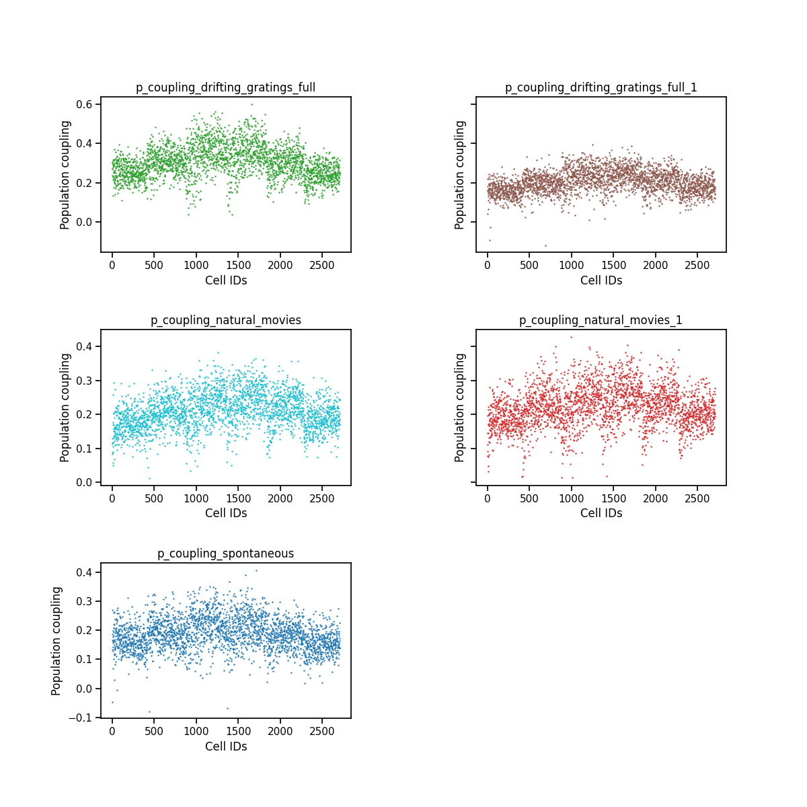

Distribution of population coupling values across all cells, showing the separation between choristers and soloists.

### Correlation Heatmaps
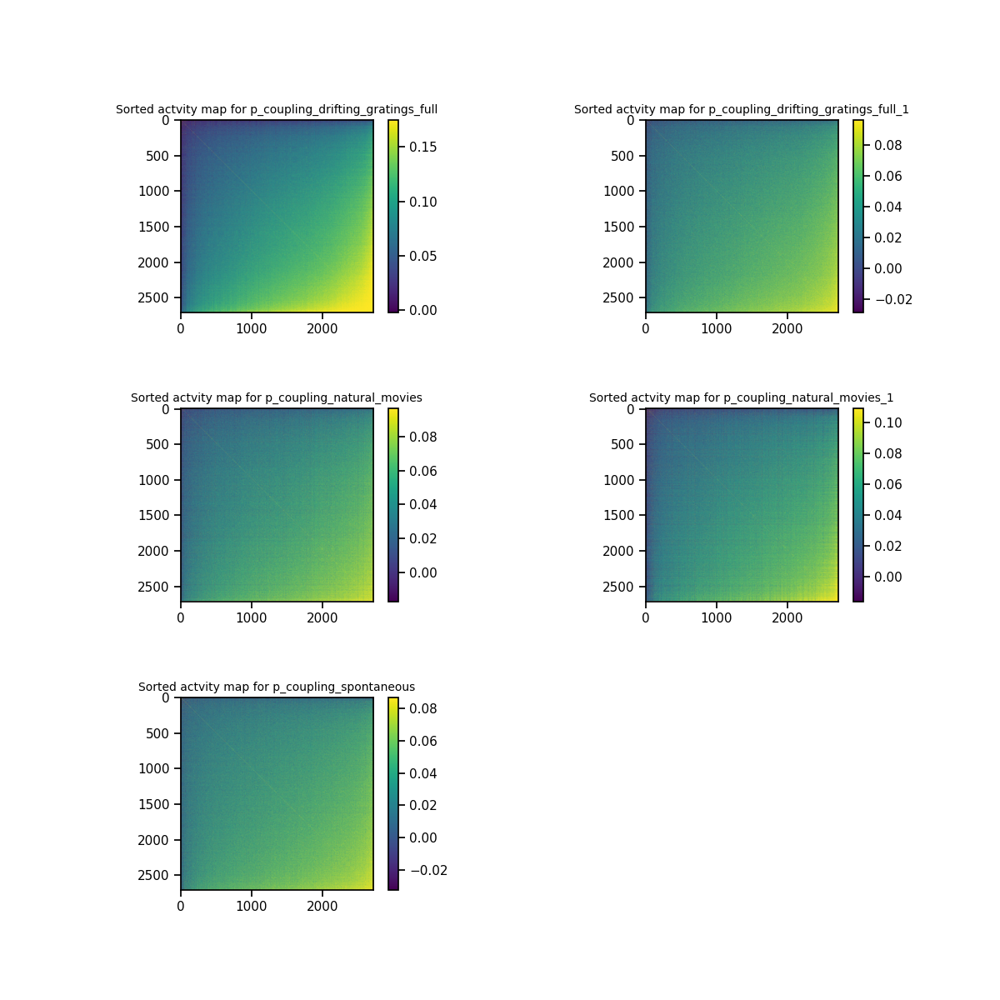

Sorted correlation matrix showing clear block structure when cells are organized by their population coupling strength.

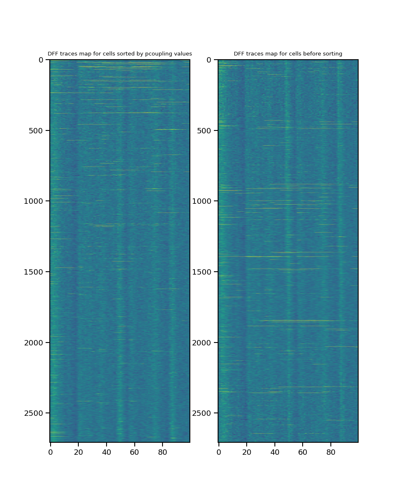

Comparison of correlation matrices before and after sorting by population coupling.

### PCA and Eigenspectrum Analysis
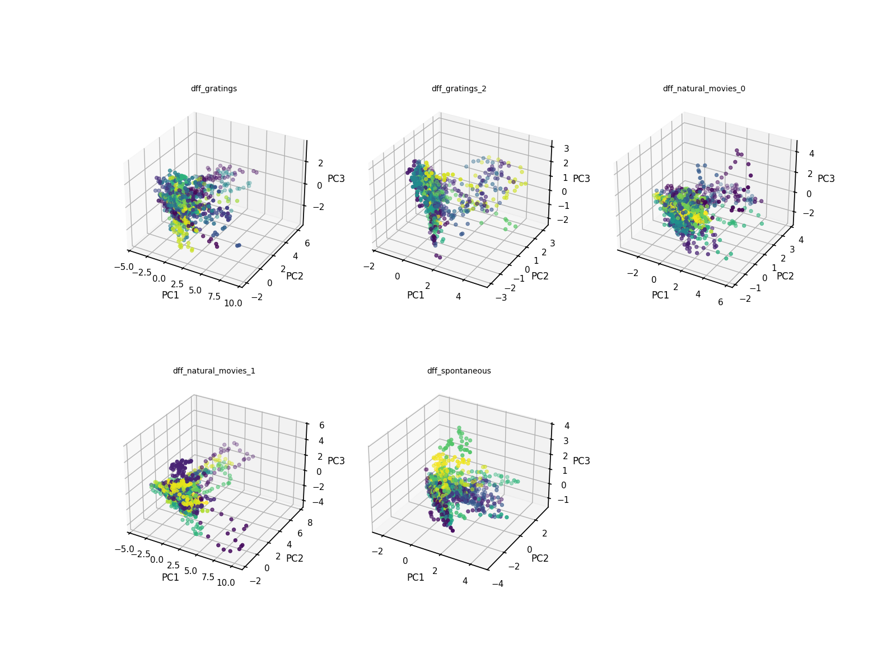

Principal component analysis showing the dimensionality of neural population activity.

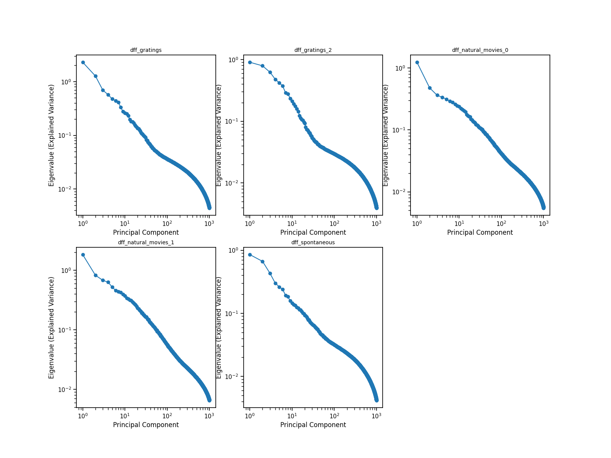

Eigenspectrum analysis revealing the effective dimensionality of the neural population.

### Cell Class Comparisons
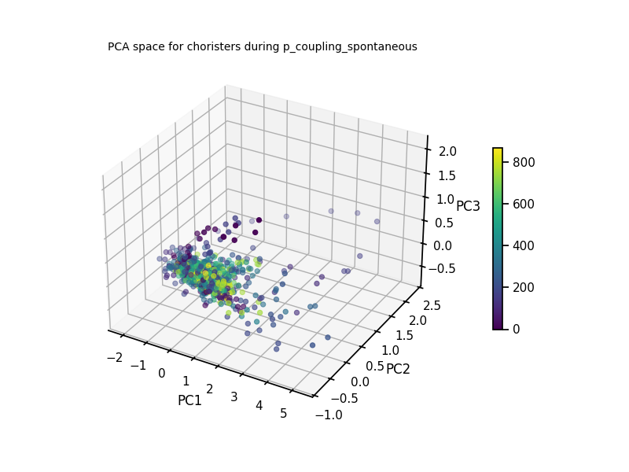
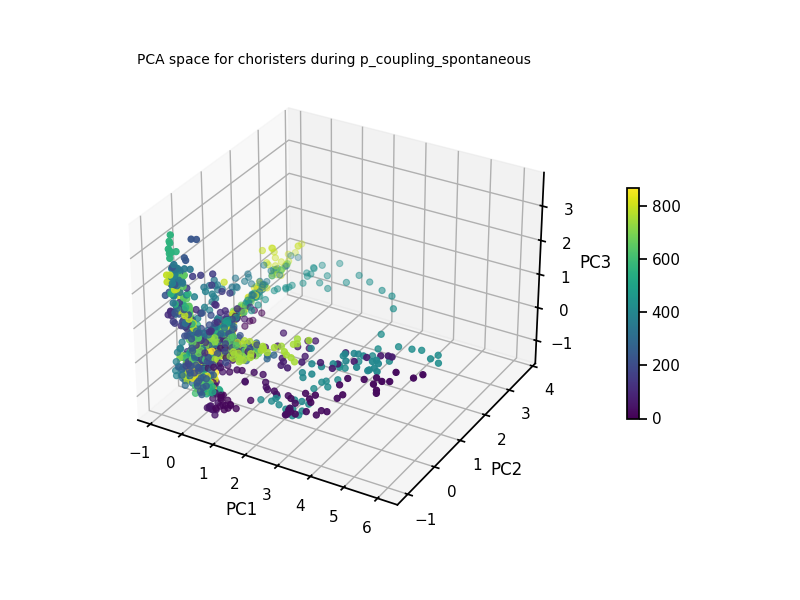

PCA analysis separately for chorister and soloist populations.

### Heatmap showing cell cell correlation for chositers and soloists 

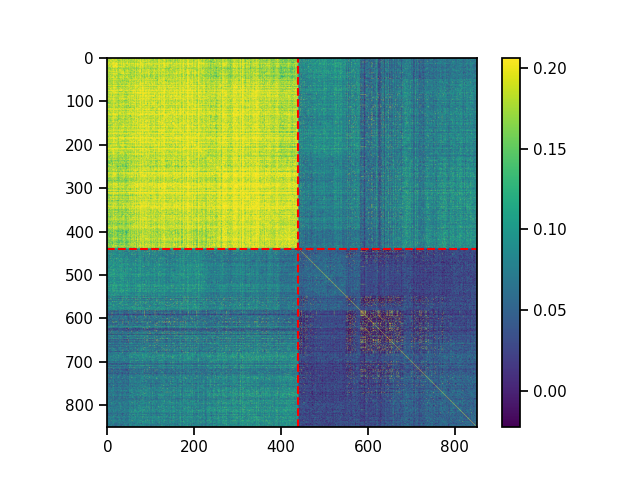

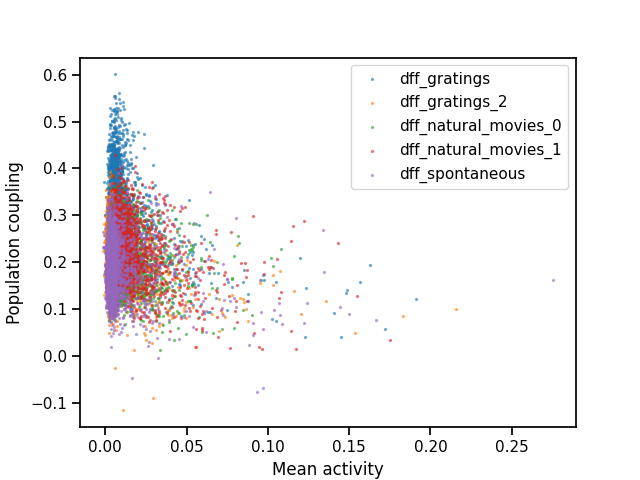

Relationship between mean neural activity and population coupling strength.

### Stimulus-Specific Responses
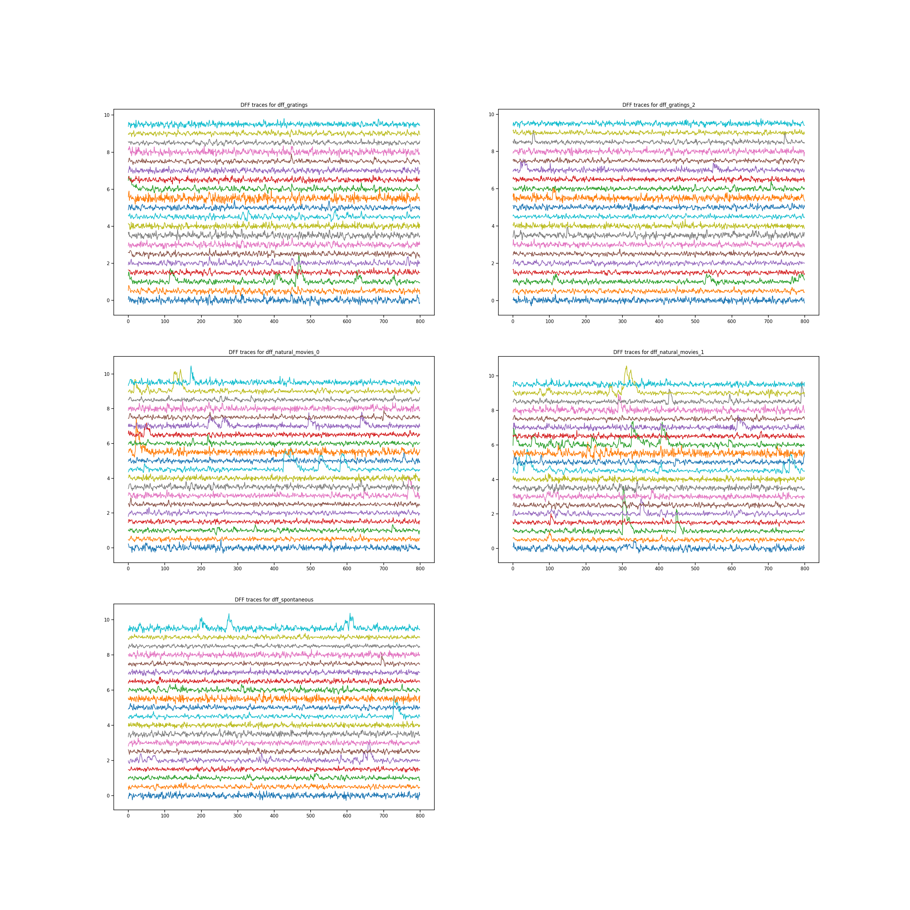

ΔF/F traces across different stimulus epochs (drifting gratings, natural movies, spontaneous activity).

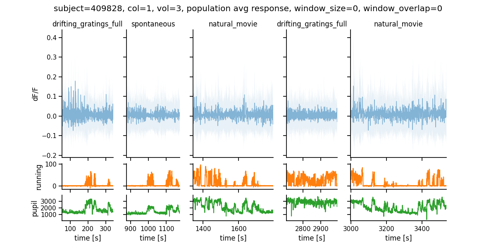

Average ΔF/F responses across different stimulus conditions.

# Additional Analyses

## Chorister vs Soloist Structural Analysis

**Notebook:** [scripts/choroist_vs_soloists.ipynb](./scripts/choroist_vs_soloists.ipynb)

This notebook examines the structural connectivity patterns underlying functional differences between choristers and soloists, including distance analysis and logistic regression modeling.

## Null Models for Structural Connectivity

**Notebook:** [scripts/null_models_structural.ipynb](./scripts/null_models_structural.ipynb)

Statistical validation using null models to assess the significance of observed structural connectivity patterns.

